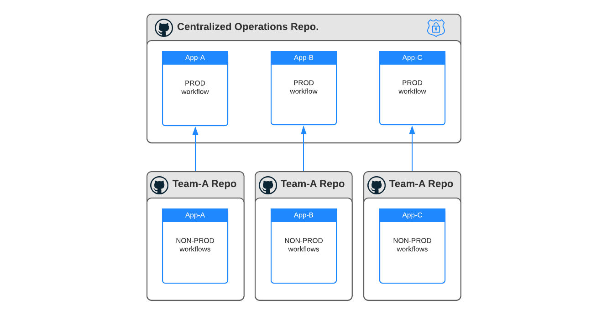
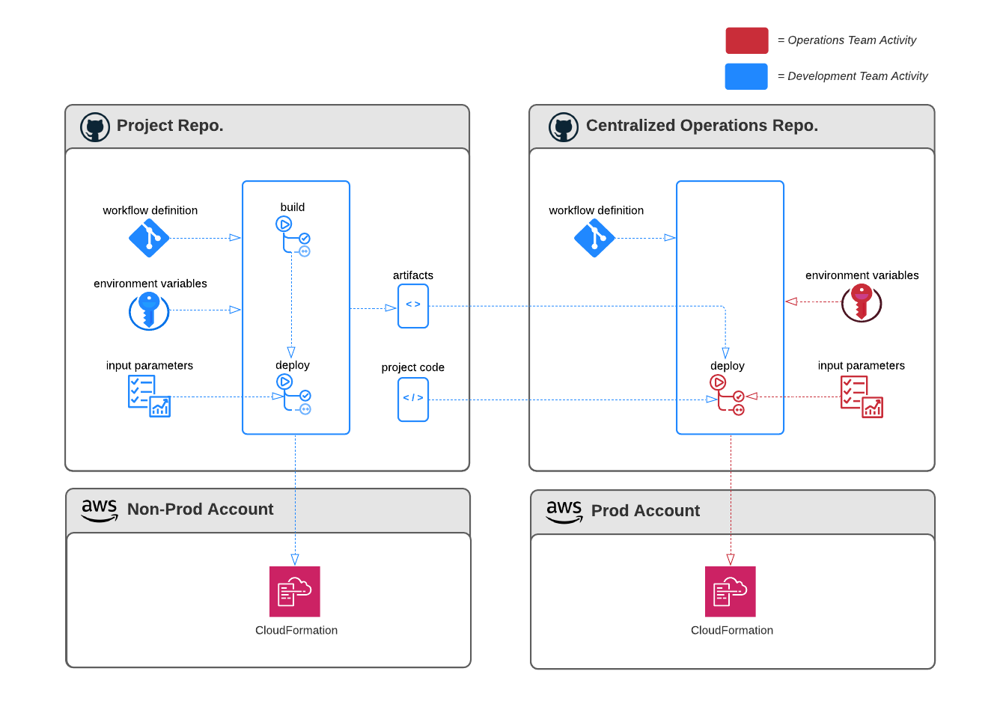
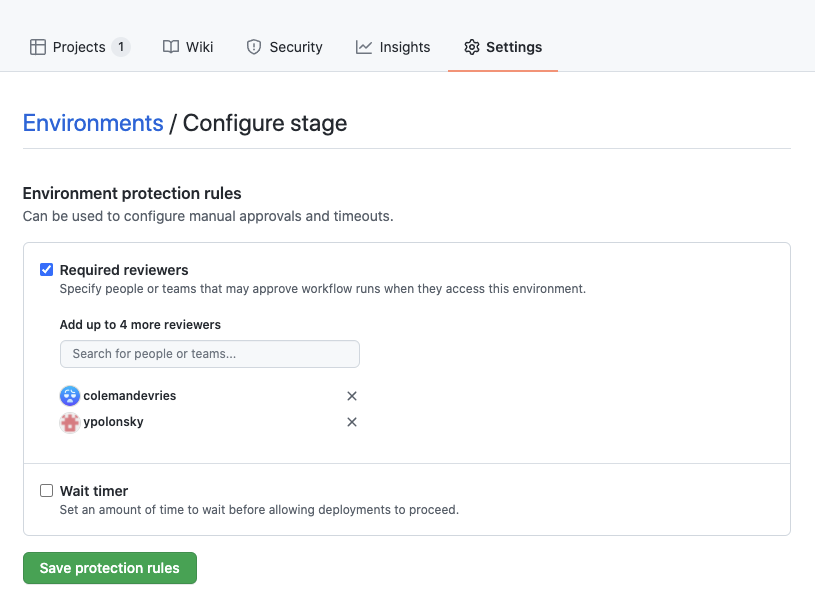

# NCI GitHub Actions Operationalization
Product teams across NCI aim to make use of new tooling introduced to the enterprise under the current GitHub Enterprise offering to deploy cloud-hosted applications. As an alternative to Jenkins, GitHub Actions is a continuous integration and continuous delivery (CI/CD) platform that allows automation of build, test, and deployment pipeline processes. 

### The Challenge
While GitHub Actions is an option for product teams within CBIIT, the enterprise needs to determine the path forward with operationalizing the service. Bringing GitHub Actions into CBIITs operational support scope requires governance and process definition. Product Development teams and Operations teams must have a clear picture of responsibilities and process that are in alignment with organizational policy, particularly as it relates to least privilege and separation of duties. 

### The Objective
To efficiently deliver GitHub Actions as a viable product Development teams can leverage for CI/CD within policy and operational constraints. Development teams want to understand the operational team's perspective in what needs to be done to adopt GitHub Actions as a CI/CD product under the support model. The approach is to allow Development teams to perform the research and validate a concept to recommend and allow for feedback from operational teams to determine if the model needs adjustment. Both Development and Operational teams must work together to streamline the adoption process.

### The Scope
This discussion is scoped to how code and infrastructure is built and deployed across environments with regard to tooling. Our attempt is not to change policies, level of privilege, or bypass existing procedures. The discussion is framed around how CBIIT can operationalize a new and available tool, what is proposed with regard to personnel responsibily, and how the proposition aligns with NCI policy.

### The Concept
Development teams are proposing a model that would allow developers to create GitHub Actions workflows that can be leveraged for build, test, and deployment of applications through all tiers. However, only Operations teams would reserve the privilege to deploy to stage and production environments. To enable developers in their efforts to define/validate workflows and execute deployments in lower tiers, we recommend the following structure:

The diagram above illustrates the idea that the Operations team can establish a centralized repository that houses the production GitHub Action workflows for all projects. This allows NCI to take advantage of GitHub's predefined roles to limit the privileges that Development teams have to execute deployments in Stage and Production environments. 

Our recommendation is to provide developers to assume a "write" role to be able to maintain workflow definitions and request workflow executions. Operations teams assume the "admin" role, which allows members to create GitHub environments, manage environment secrets, create deployment review checkpoints, and execute deployment workflows. This recommendation ( 1 ) reduces the Operations team workload in creating deployment pipelines; ( 2 ) puts responsibility on developers to correctly configure workflow jobs; and ( 3 ) preserves separation of duty and least privilege to comply with policy. For more about GitHub repository roles, please [click here](https://docs.github.com/en/organizations/managing-access-to-your-organizations-repositories/repository-roles-for-an-organization).

### The Details (under construction!)
This section describes how GitHub Actions is configured to support the proposed model by illustrating the build and deploy processes, where permission contraints are applied, and assets are exchanged across repositories to facilitate the CI/CD process. The diagram below depicts how separation of responsibility, least privilege, and DevOps principles (build one, deploy to many) are applied. While the illustration in the above section depicts the true relationship between the Centralized Operations Repository and the Project Repositories (one-to-many), the detail in the diagram below just focuses on the exchange with one project repository.

As expressed by the legend above the diagram, there are clearly distinguished activities that are handled by the Development teams and Operations teams. In the Centralized Operations Repository, notice that Development teams have permissions and responsibility to provide three of the five inputs for workflow execution: workflow definitions, build artifacts, and project code (IaC templates, shell scripts, etc.). These three inputs either source from, or identically mirror, the project repository workflows. This reduces operational overhead assumed by Operations teams to configure pipelines.

The two other inputs required to successfully execute a workflow where the target environments are Stage or Prod tiers are managed by the Operations team. These two inputs are input parameters and environment variables that contain secrets to facilitate authentication with the target account. 

- The GitHub environment configuration is specified by the development teams in a service request (submitted through ServiceNow) to set-up the upper-tier pipeline. Once configured, this step does not need to be repeated for a project (unless rotating secrets or changing target environments). To avoid administrative overhead for the Operations team, Development teams recommend using OIDC to authenticate with AWS environments. OIDC configuration and it's feasibility is out of scope of this discussion.

- Development teams also are responsible for specifying input parameters, which are unique to each workflow execution. Therefore, Development teams must supply the desired input parameters in the deployment service request submitted through ServiceNow.

### The Governance
If Development teams have assumed the "write" repository role, can't they invoke their production deployment workflows? Yes - by default, that is possible. However, GitHub repository members who hold the "admin" role have the ability to specify workflow reviewers. Only repository administrators can set and change the workflow review policy, specify recipient of review notifications, and remove reviewer steps. 

### The Process (under construction!)
this is where we spell out that the deployment process remains the same - we submit a ticket through ServiceNow, providing instructions and input parameters. 
We also need to discuss the process for setting up GitHub environments.

### The Responsibilities (under construction!)
just to make things black and white, we can create a table that distinguishes who is responsible for what.
